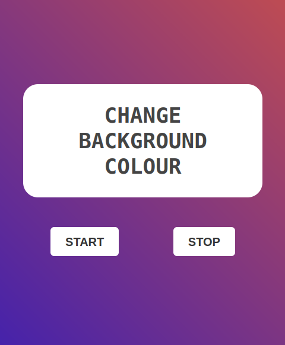

# Random Background Color Changer

This web app dynamically changes the background color of the page to random colors every second. It includes **Start** and **Stop** buttons for controlling the color-changing process. Built with **HTML**, **CSS**, and **JavaScript**, this project is ideal for practicing DOM manipulation and event handling.

## Screenshots

## Live Demo

Check out the live demo of the app [here](https://swag3009.github.io/Background_Colour_Change/).  

## Features

- Automatically changes the background color randomly every second.
- Provides Start and Stop buttons to control the color-changing process.
- Simple, clean, and responsive design.
- Lightweight implementation with vanilla JavaScript.

## Project Structure

- **HTML**: Defines the structure of the app.
- **CSS**: Provides styling and layout for the buttons and background.
- **JavaScript**: Implements the logic for random color generation and interval control.

## How to Use

1. Clone or download the repository.
2. Open the HTML file in your browser.
3. Use the Start button to begin changing the background color.
4. Use the Stop button to pause the color-changing process.

## Technologies Used

- HTML
- CSS
- JavaScript

## Learning Outcomes

- Improved understanding of DOM manipulation.
- Experience with JavaScript functions such as setInterval and clearInterval.
- Gained familiarity with creating interactive web applications.

